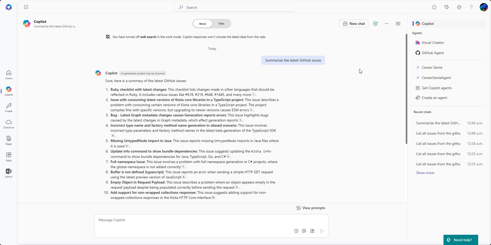
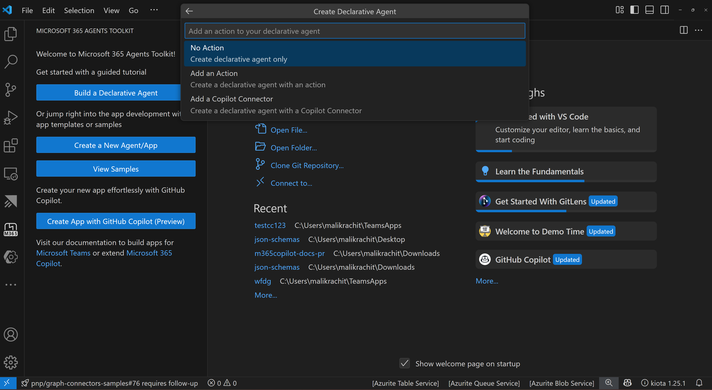

# Copilot connector Template

## Summary

This sample project uses Microsoft 365 Agents Toolkit for Visual Studio Code to simplify the process of creating a [Microsoft Copilot connector](https://learn.microsoft.com/graph/connecting-external-content-connectors-overview) that ingests data from the GitHub issues API to Microsoft Graph. It provides an end to end opinionated starting point of creating the connector, ingesting content and refreshing the ingested content.



## Features

This template shows how to ingest data from a custom API into your Microsoft 365 tenant.
It uses the GitHub API to provide a sample use case and is intended to be a starting point to help you bring your data in M365 Copilot and then customize it to your needs and LoB (Line of Business) APIs.

The template illustrates the following concepts:

- Simplify debugging and provisioning of resources with Microsoft 365 Agents Toolkit for Visual Studio code
- Create external connection schema
- Support full ingestion of data
- Support incremental ingestion of data
- Visualize the external content in Microsoft 365 Copilot. 
- Bonus: You can also add a new custom Copilot connector when you create a Declarative Agent (DA) in M365 Agents Toolkit.


## Contributors

- [Sébastien Levert](https://github.com/sebastienlevert)
- [Luis Javier Fernández](https://github.com/luisjfdez)
- [Rachit Malik](https://github.com/RachitMalik12)

## Version History

Version|Date|Comments
-------|----|--------
1.0|December 03, 2024|Initial release
1.1|April 15, 2025|Additional comments and minor improvements
1.2|April 21, 2025|Rebrand and remove unecessary steps 

## Prerequisites

- [Microsoft 365 Agents Toolkit for Visual Studio Code](https://marketplace.visualstudio.com/items?itemName=TeamsDevApp.ms-teams-vscode-extension)
- [Azure Functions Visual Studio Code extension](https://marketplace.visualstudio.com/items?itemName=ms-azuretools.vscode-azurefunctions)
- [Microsoft 365 Developer tenant](https://developer.microsoft.com/microsoft-365/dev-program) with [uploading custom apps enabled](https://learn.microsoft.com/microsoftteams/platform/m365-apps/prerequisites#prepare-a-developer-tenant-for-testing)
- [Node.js](https://nodejs.org/), supported versions: 18, 20, 22
- Have the ability to admin consent in Entra Admin Center. See [Grant tenant-wide admin consent to an application](https://learn.microsoft.com/en-us/entra/identity/enterprise-apps/grant-admin-consent?pivots=portal#prerequisites) for the required roles

## Minimal path to awesome - Debug against a real Microsoft 365 tenant

- Create the project by **Microsoft 365 Agents Toolkit** 
- Fill env file in `env` folder
  - Open the `.env.local`. Update the `CONNECTOR_REPOS` value
- Press <kbd>F5</kbd>, follow the sign in prompts
- When prompted, click on the link in the console to perform the tenant-wide admin consent
- Wait for all tasks to complete
- In the web browser navigate to the [Search & Intelligence](https://admin.microsoft.com/#/MicrosoftSearch/Connectors) area in the Microsoft 365 Admin Center
- A table will display available connections. Locate the **GitHub Issues** connection. In the **Required actions** column, select the link to **Include Connector Results** and confirm the prompt
- Navigate to [Microsoft 365 Copilot](https://m365.cloud.microsoft/chat)
- Using the search box on top, search for: `Summarize the latest GitHub issues`. You should see the following result:


> [!NOTE]  
> It can take a moment for the results to appear. If you don't see the results immediately, wait a few moments and try again.
> If you are getting results from the web, you can turn off web for better isolation of your connector results.

## Further customization

This template is an opinionated starting point for your own connector. You can further customize it by making changes to the code and configuration files. As a general guide, you can update the content of the following folders:
- `src/custom`: This folder contains custom code to gather and transform data to be ingested into Microsoft Graph. Although the example uses the GitHub issues API, you can replace it with any other API.
- `src/references`: This folder includes the schema definition of the connector. Adjust it to match the data and metadata you want to ingest. 
- `src/models`: This folder contains the model definition for an internal representation of the data and configuration, both models can be customized to fit your needs.

In addition to those folders, other parts of the code might be customized depending on the scenario. You can search the code for comments starting with the `[Customization point]` string, which indicate candidate areas for customization.

### Use GitHub Personal Access Token

If you want to index content from private GitHub repositories, or you want to be able to have a higher rate limit for the GitHub API, you need to follow the steps below:

- Create a GitHub fine-grained token
  - Go to [GitHub](https://github.com)
  - Click on your profile picture and select **Settings**
  - In the left sidebar, click on **Developer settings**
  - In the left sidebar, click on **Personal access tokens**
  - In the left sidebar, click on **Fine-grained tokens**
  - Click on **Generate new token**
  - Give it a name and an expiration
  - Select the **All repositories** access
  - In the **Repository permissions** section, select
    - Issues: Read-Only
    - Metadata: Read-Only
  - Click on **Generate token**
  - Copy the token
- Fill env file in `env` folder for local environment
  - Open the `.env.local.user` and add there your GitHub token as the `SECRET_CONNECTOR_ACCESS_TOKEN` value
- Uncomment the `CONNECTOR_ACCESS_TOKEN` line in the `m365agents.local.yml` file 

### Deployment in Azure

To deploy the connector in Azure, you need to follow these steps:

- Fill env file in `env` folder for dev environment
  - Open the `.env.dev`. Update the `CONNECTOR_REPOS` value and the `CONNECTOR_ID` value
- Go to **Microsoft 365 Agents Toolkit** `Lifecycle` tab and select **Provision**. This will create the Azure resources needed for the connector
- Go to **Microsoft 365 Agents Toolkit** `Lifecycle` tab and select **Deploy**. This will deploy the Azure Function application with the connector code

If using a GitHub personal access token, it is needed to follow these additional steps:

- Open `.env.dev.user` and add there your gitHub token as the `SECRET_CONNECTOR_ACCESS_TOKEN` value
- Add this parameter to `azure.parameters.json` file in `infra` folder:
```json
    "connectorReposAccessToken": {
      "value": "${{SECRET_CONNECTOR_ACCESS_TOKEN}}"
    }
```

Once the deployment is finished, you can go to the Azure portal and navigate to the Azure Function application. You will see three functions created:
- `deployConnection`: This function is run once per day and it ensures that the connection is up to date. Run it manually if you want to accelerate crawling since it is needed to run, at least once, for the other functions to work.
- `fullCrawl`: This function is run once per day and it ensures that all the content is crawled. Run it manually if you want to test in advance.
- `incrementalCrawl`: This function is run every minute and it ensures that the content is updated. You can run it manually as well.

*Note*: For Azure based deployments, it is needed to give admin consent to the permissions of the connector app for this deployment. You can find the Application (Client) ID of this application looking into `AZURE_CLIENT_ID` environment variable defined for the Azure Function application.